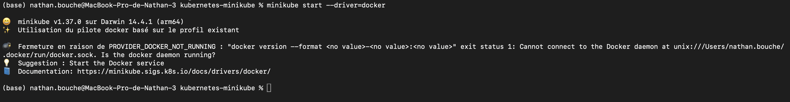
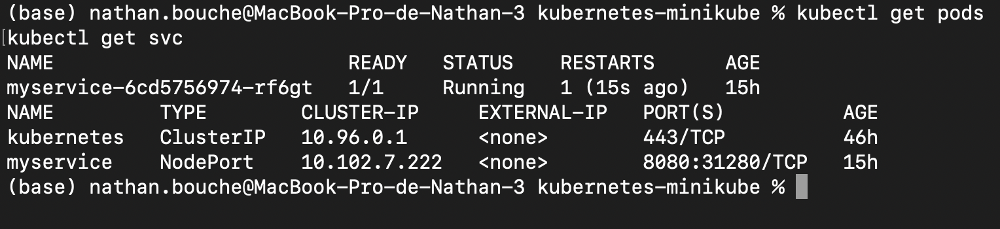
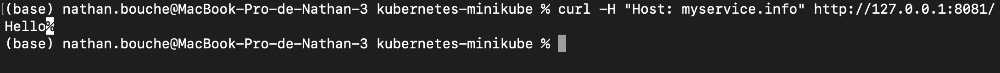
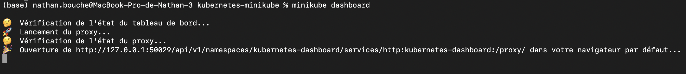
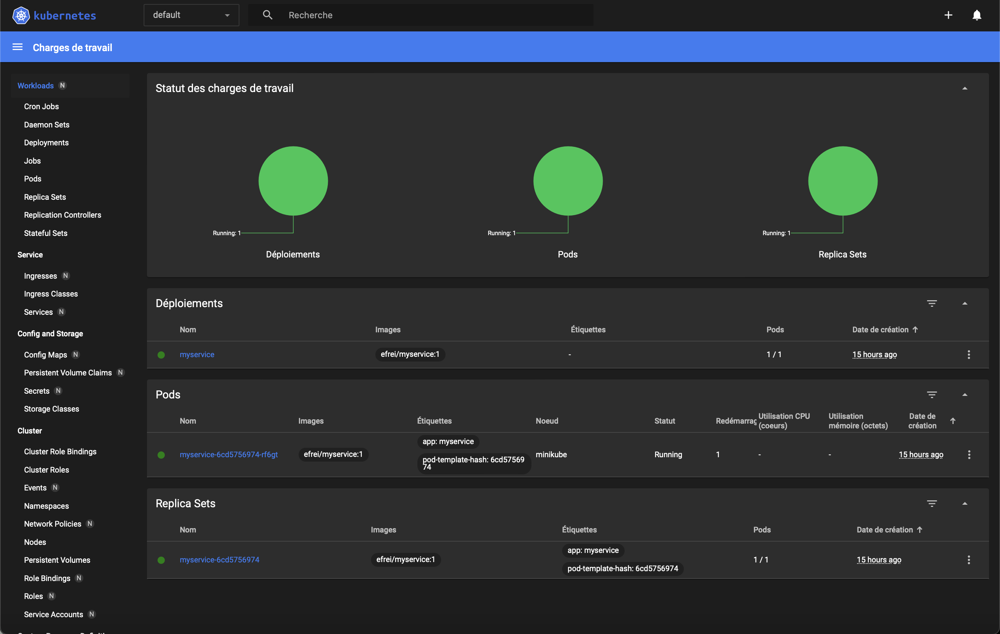

# RentalService – Docker & Kubernetes

Projet réalisé dans le cadre du **TP Docker & Kubernetes** (INGNUM).

Ce projet met en œuvre l’ensemble des notions vues en cours :
- Dockerisation d’un microservice Java Spring Boot
- Création d’un second microservice en PHP
- Communication HTTP entre microservices
- Orchestration avec Docker Compose
- Déploiement sur Kubernetes avec Minikube
- Exposition via Service, NodePort et Ingress
- Supervision via le Dashboard Kubernetes

---

## TP1 – Dockerisation du microservice Java

### Objectif
L’objectif de ce TP est de dockeriser une application Java Spring Boot (Gradle) afin de la rendre portable et exécutable dans un environnement conteneurisé.

---

### Build du projet Java
Commande utilisée :
./gradlew build

 
➡️ Build Gradle réussi avec le message **BUILD SUCCESSFUL**

---

### Exécution en local (sans Docker)
Commande :
java -jar build/libs/RentalService-0.0.1-SNAPSHOT.jar

Accès via navigateur :
http://localhost:8080/bonjour

➡️ Le navigateur affiche correctement le message *Hello / Bonjour*

---

### Dockerisation de l’application

Dockerfile utilisé :
FROM eclipse-temurin:21  
VOLUME /tmp  
EXPOSE 8080  
ADD build/libs/RentalService-0.0.1-SNAPSHOT.jar app.jar  
ENTRYPOINT ["java","-jar","/app.jar"]

Ce Dockerfile permet :
- d’utiliser une image Java officielle
- d’exposer le port 8080
- de lancer l’application Spring Boot au démarrage du conteneur

---

### Build de l’image Docker
Commande :
docker build -t rentalservice .

➡️ Image Docker construite avec succès

---

### Exécution du conteneur Docker
Commande :
docker run -p 8080:8080 rentalservice

Accès via navigateur :
http://localhost:8080/bonjour
  
➡️ Accès à l’application depuis un conteneur Docker

---

## TP2 – Création d’un second microservice PHP

### Objectif
Mettre en place un second microservice simple en PHP afin de simuler une architecture microservices.

---

### Structure du microservice PHP
php-service/  
├── Dockerfile  
└── index.php  

---

### Build de l’image PHP
Commande :
docker build -t nathanbch/php-service .

---

### Exécution du microservice PHP
Commande :
docker run -p 8081:80 nathanbch/php-service

Accès via navigateur :
http://localhost:8081

➡️ Page PHP affichant correctement *Hello*

---

### Publication sur Docker Hub
L’image PHP a été publiée sur Docker Hub.

Lien :
https://hub.docker.com/r/nathanbch/php-service

➡️ Page Docker Hub de l’image

---

## TP2 – Communication HTTP entre microservices

### Objectif
Permettre au microservice Java de communiquer avec le microservice PHP via une requête HTTP.

---

### Orchestration avec Docker Compose
Commande :
docker-compose up --build

Les services sont lancés sur le même réseau Docker, ce qui permet la communication interne.

Endpoints disponibles :
- Java : http://localhost:8080/bonjour  
- PHP : http://localhost:8081  
- Appel PHP depuis Java : http://localhost:8080/appel-php  

➡️ Terminal docker-compose + navigateur montrant la réponse du service PHP appelée depuis le service Java

---

## TP3 – Déploiement Kubernetes avec Minikube

### Objectif
Déployer le microservice Java dans un cluster Kubernetes local et l’exposer via différents mécanismes.

---

### Démarrage du cluster Minikube
Commande :
minikube start --driver=docker

➡️ Statut Minikube indiquant que tous les composants sont *Running*

---

### Déploiement Kubernetes
Les ressources suivantes sont utilisées :
- Deployment
- Service (NodePort)

Commandes :
kubectl apply -f myservice-deployment.yml  
kubectl apply -f myservice-service.yml  

Vérification :
kubectl get pods  
kubectl get svc  

➡️ Pod en état *Running* et Service exposé en NodePort

---

### Accès via NodePort
Commande :
minikube service myservice --url

➡️ Accès à l’application via l’URL fournie par Minikube

---

### Mise en place d’un Ingress (Gateway)

Activation de l’Ingress Controller :
minikube addons enable ingress  
minikube tunnel  

Déploiement de l’Ingress :
kubectl apply -f ingress.yml  
kubectl get ingress  

Test via header HTTP :
curl -H "Host: myservice.info" http://127.0.0.1:8081/

➡️ Réponse HTTP 200 avec le message *Hello*

⚠️ L’accès direct à http://127.0.0.1:8081 retourne une erreur 404.  
Ce comportement est normal : l’Ingress repose sur le routage par nom de domaine (Host header).

---

### Dashboard Kubernetes
Commande :
minikube dashboard

➡️ Dashboard affichant Deployment, Pod et ReplicaSet en état fonctionnel

---

## Conclusion

Ce projet met en œuvre une architecture microservices complète :

- TP1 : Dockerisation d’un microservice Java Spring Boot ✅  
- TP2 : Création d’un microservice PHP et communication HTTP ✅  
- TP3 : Déploiement Kubernetes avec Service, Ingress et Dashboard ✅  

L’ensemble des fonctionnalités demandées a été implémenté avec succès.  
Le projet est conforme aux consignes et pleinement opérationnel.
